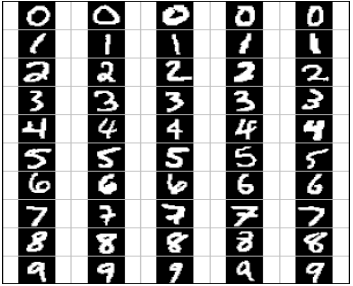
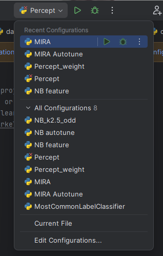

# Machine Learning Image Identifier

This is a project template from UC Berkeley, for a machine learning program that identifies images of numbers (0-9), extracted using optical character recognition. For this project, I have implemented the machine learning classification algorithms used to train the program and label the images with their corresponding number. The classifiers implemented were a naïve Bayes classifier, a perceptron classifier, and a large-margin (MIRA) classifier. These classifiers work iteratively on given training sets, improving accuracy by adjusting weights accordingly. 

## Classifiers

- **Naïve Bayes:** Naïve Bayes is a simple probabilistic classifier that applies Bayes' theorem with independent assumptions between the features. 

- **Perceptron:** A linear classifier that learns a linear decision boundary by iteratively updating the weights based on misclassified samples until convergence or a predefined number of iterations. 

- **MIRA:** MIRA is a variant of the perceptron algorithm designed to address the issue of excessive updates in traditional perceptron training, preventing overfitting to noisy training data. 

## How does it work?

The images are extracted and stored in R files, then converted into array data. The classifiers examine which indices of the given arrays are filled or empty to decide which labels to apply. Each classifier works iteratively by labeling the images and then comparing them to the results in the training set to adjust the weights of each classification label. The arrays are not shuffled to result in consistent results. However, it should be noted that shuffling the training set every iteration can yield either higher or lower results than the default ordering.

<p align="center">
 
</p>

## Requirements

- Python 3.x (Reccomended to use Python Version 3.9 or 3.10)

- PyCharm (Community Edition)

## Installation and Use

Follow these steps to set up and run the Image Identifier:

1. Download or clone the repository to your local machine:

  ```bash
  git clone https://github.com/Daksh2060/image-identification-machine-learning
  ```

2. Open the folder in PyCharm.


3. Run the given configurations to test out the different classifiers.

  <p align="center">
   
  </p>

  
## Contact

Feel free to reach out if you have any questions, suggestions, or feedback:

- **Email:** dpa45@sfu.ca
- **LinkedIn:** [@Daksh Patel](https://www.linkedin.com/in/daksh-patel-956622290/)
